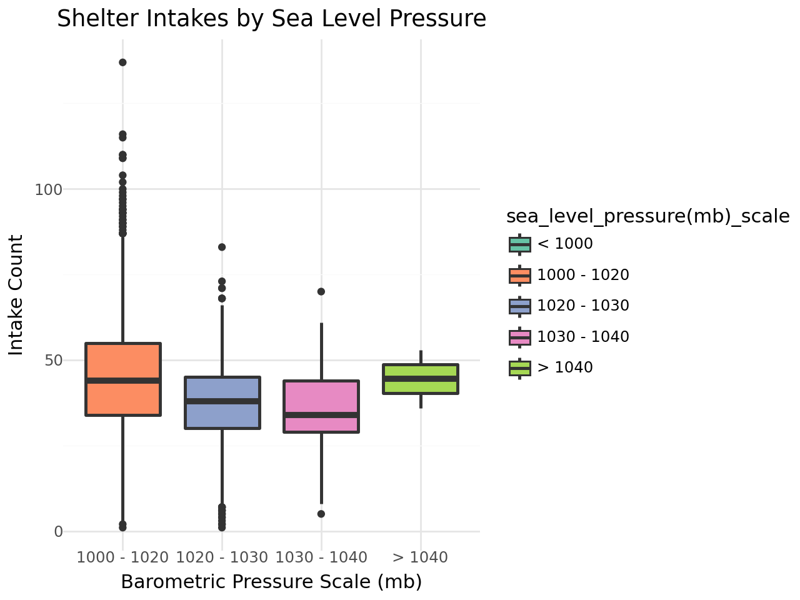

# moon-phase-weather-shelter-analysis
Statistical analysis and non-parametric hypothesis testing evaluating the operational impact of lunar cycles and inclement weather on animal shelter intake volumes.


# Environmental and Lunar Influences on Animal Shelter Operational Volume

## Executive Summary
This project bridges 15 years of veterinary clinical intuition with data analytics to investigate a long-held belief in emergency medicine: that lunar cycles and environmental conditions impact patient intake surges and critical outcomes. By merging longitudinal animal shelter data with localized historical weather records from Austin, Texas, this analysis applies non-parametric statistical methods to evaluate operational patterns.

* **Business Goal:** Enable animal shelter networks and emergency veterinary facilities to optimize staffing, resource allocation, and budget planning based on predictable environmental surge factors.
* **Key Result:** Statistical testing successfully debunked the "Full Moon Effect," revealing no significant correlation with intake surges. However, severe weather indicators (barometric pressure drops and extreme temperatures) were identified as highly statistically significant drivers of shelter volume spikes.

## The Data
* **Source:** Relational integration of Austin Animal Center Intake/Outcome records (2013–2021) and localized Austin historical climatology data (2000–2023) sourced from Kaggle.
* **Dataset Scope:** Multi-year tracking filtered strictly to canine and feline populations, isolating operational episodes and matching terminal outcomes (euthanasia, died, disposal) into a unified critical mortality baseline.
* **Feature Transformations:** Continuous metrics were engineered into meaningful operational thresholds. Lunar illumination (0.0 - 1.0) was discretized into standard lunar phases. Environmental variables (precipitation, visibility, humidity, and barometric pressure) were categorized into standard meteorological bins.

## Methodology & Architecture
1. **Statistical Assumption Testing:** Executed Quantile-Quantile (Q-Q) plots and Shapiro-Wilk testing to evaluate feature distributions. The target volume data significantly violated normality assumptions (p < 0.05), mandating a transition away from traditional parametric analysis.
2. **Non-Parametric Analysis:** Implemented Kruskal-Wallis Rank Sum testing to evaluate differences in median intake and mortality rates across non-normal categorical lunar phases.
3. **Post-Hoc Pairwise Testing:** Conducted Pairwise Wilcoxon Rank Sum tests with adjusted p-values to isolate specific environmental thresholds driving significant volume variances.

### Project Directory Structure
```
├── data/               # Raw and filtered shelter and weather CSVs
├── images/             # Generated analytical visualizations
│   └── shelter_intakes_by_pressure.png
├── src/                # Modular pipeline execution notebooks
│   ├── moonphase-and-weather-data-extraction.ipynb
│   ├── moonphase-and-weather-data-engineering.ipynb
│   └── moonphase-and-weather-data-analysis.ipynb
├── requirements.txt    # Managed package dependencies
└── README.md
```

### Feature Selection and Dimension Reduction
Initial Ordinary Least Squares (OLS) regression mapping revealed identical, highly correlated slopes between overall intake volume and patient mortality. Furthermore, solar energy, solar radiation, and absolute temperature presented extreme multicollinearity. To prevent model redundancy, the workflow dropped the mortality vector to focus purely on intake surges, selecting "Feels-Like Temperature" as the single representative metric for heat-related stress.

### Non-Parametric Framework Selection
Because both the intake and transformation datasets failed the fundamental assumptions of normal distribution normality (p < 0.05), classical ANOVA testing was rejected. Implementing the Kruskal-Wallis test ensured mathematically robust conclusions that do not rely on a symmetric bell-curve distribution.

## Key Findings & Operational Insights
* **The Lunar Myth:** Median intake volume and mortality rates showed no statistically significant variance across moon phases, successfully rejecting the hypothesis of a full-moon behavior surge.
* **Barometric Pressure Surges:** Sea-level barometric pressure drops (1000–1020mb vs 1020–1030mb) yielded an incredibly strong statistical significance (p = 2.58e-23), proving that arriving weather fronts actively trigger influxes of stray or surrendered animals.
* **Inclement Weather Dynamics:** Significant spikes occurred during heavy rainfall events (p = 0.037) and low-visibility conditions (p = 0.011). This highlights a clear "human variable" where the public proactively brings vulnerable animals to safety during adverse weather.



## Future Roadmap & Operational Extensions

To further refine the predictive accuracy of the intake models and Monte Carlo simulations, the next phase of development will focus on the following core data integrations and engineering enhancements:

* **Holiday and Seasonal Trend Feature Engineering (with Post-Holiday Lag):**
    * *Rationale:* Integrate federal and major cultural holidays (e.g., 4th of July, New Year's Eve) to account for predictable stray spikes caused by fireworks and community displacement. This feature will include a 48-hour post-holiday "lag window" to capture delayed processing and intake surges that occur right after a holiday weekend.
* **Intake Type Segmentation:**
    * *Rationale:* Segment the primary intake vector into distinct categories (e.g., Strays vs. Owner Surrenders vs. Adoption Returns). Environmental factors like barometric pressure and severe weather heavily impact stray pickups, whereas owner surrenders are typically driven by non-weather variables like socioeconomic shifts or end-of-month lease cycles.
* **Autoregressive and Baseline Moving Averages:**
    * *Rationale:* Incorporate autoregressive modeling components ($t-1$, $t-7$) or a rolling 7-day population moving average. Because shelter overflow risk is deeply cumulative, establishing yesterday's baseline volume is critical for accurately predicting tomorrow's capacity threshold break.

## Getting Started & Installation

### Prerequisites
Establish a local virtual environment and install the verified data science stack:
```bash
python -m venv venv
source venv/bin/activate  # On Windows use `venv\Scripts\activate`
pip install -r requirements.txt
```
