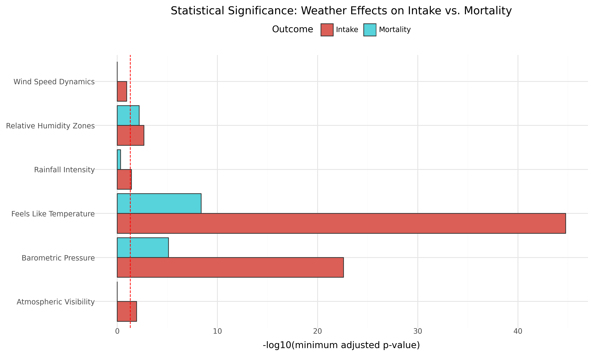
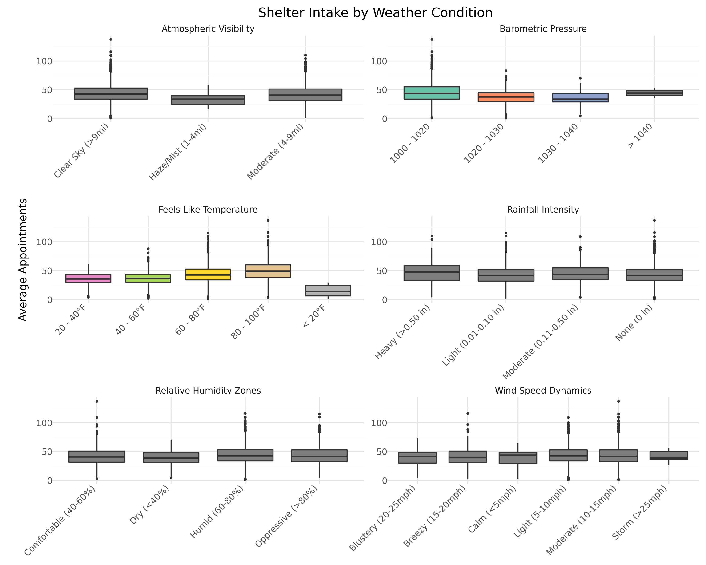
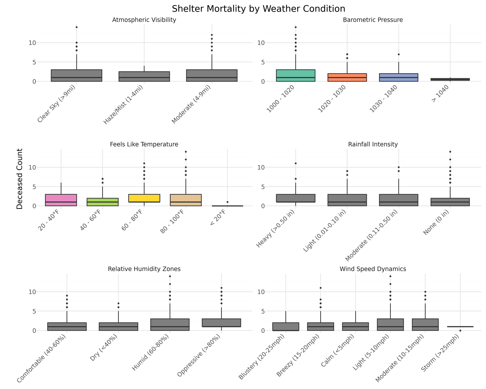

# moon-phase-weather-shelter-analysis
Statistical analysis and non-parametric hypothesis testing evaluating the operational impact of lunar cycles and inclement weather on animal shelter intake volumes and mortality.

# Environmental and Lunar Influences on Animal Shelter Operational Volume

## Data Correction Note
An earlier version of this analysis found "identical, highly correlated slopes" between intake volume and mortality, and used that finding to justify excluding mortality from the weather analysis entirely. That finding was a data bug: the `p_deceased` field was being computed as a count of *all* processed outcomes, not deaths specifically, which mechanically forced it to track intake volume almost exactly. Corrected to count actual deaths (`outcome_category = 'deceased'`), mortality turns out to be a distinct, independently analyzable outcome. It has since been tested against the same six weather variables and bin structure as intake volume, using the same non-parametric methodology described below.

## Executive Summary
This project bridges 15 years of veterinary clinical intuition with data analytics to investigate a long-held belief in emergency medicine: that lunar cycles and environmental conditions impact patient intake surges and critical outcomes. By merging longitudinal animal shelter data with localized historical weather records from Austin, Texas, this analysis applies non-parametric statistical methods to evaluate operational patterns for both intake volume and mortality.

* **Business Goal:** Enable animal shelter networks and emergency veterinary facilities to optimize staffing, resource allocation, and budget planning based on predictable environmental surge factors.
* **Key Result:** Statistical testing successfully debunked the "Full Moon Effect," revealing no significant correlation with intake surges or mortality. Weather affects intake and mortality through overlapping but distinct channels: barometric pressure drops and cold temperatures drive both, but far more forcefully for intake volume; rainfall and low visibility drive intake volume only; humidity affects mortality with comparable or slightly greater strength than intake.

## The Data
* **Source:** Relational integration of Austin Animal Center Intake/Outcome records (2013–2021) and localized Austin historical climatology data (2000–2023) sourced from Kaggle.
* **Dataset Scope:** Multi-year tracking filtered strictly to canine and feline populations, isolating operational episodes and matching terminal outcomes (euthanasia, died, disposal) into a unified critical mortality baseline.
* **Feature Transformations:** Continuous metrics were engineered into meaningful operational thresholds. Lunar illumination (0.0 - 1.0) was discretized into standard lunar phases. Environmental variables (precipitation, visibility, humidity, and barometric pressure) were categorized into standard meteorological bins.

## Methodology & Architecture
1. **Statistical Assumption Testing:** Executed Quantile-Quantile (Q-Q) plots and Shapiro-Wilk testing to evaluate feature distributions. The target volume data significantly violated normality assumptions (p < 0.05), mandating a transition away from traditional parametric analysis.
2. **Non-Parametric Analysis:** Implemented Kruskal-Wallis Rank Sum testing to evaluate differences in median intake and mortality rates across non-normal categorical lunar phases and weather bins.
3. **Post-Hoc Pairwise Testing:** Conducted Pairwise Wilcoxon Rank Sum tests with Bonferroni-adjusted p-values to isolate specific environmental thresholds driving significant volume and mortality variances.

### Project Directory Structure
```
├── data/               # Raw and filtered shelter and weather CSVs
├── images/             # Generated analytical visualizations
│   ├── weather_significance_summary.png
│   ├── weather_v_intake_boxplots.png
│   └── weather_v_mortality_boxplots.png
├── src/                # Modular pipeline execution notebooks
│   ├── moonphase-and-weather-data-extraction.ipynb
│   ├── moonphase-and-weather-data-engineering.ipynb
│   └── moonphase-and-weather-data-analysis.ipynb
├── requirements.txt    # Managed package dependencies
└── README.md
```

### Non-Parametric Framework Selection
Because both the intake and mortality datasets failed the fundamental assumptions of normal distribution (p < 0.05), classical ANOVA testing was rejected. Implementing the Kruskal-Wallis test and Bonferroni-adjusted pairwise Wilcoxon comparisons ensured mathematically robust conclusions that do not rely on a symmetric bell-curve distribution, and that account for the multiple-comparisons problem introduced by testing several weather-bin pairs per variable.

## Key Findings & Operational Insights
* **The Lunar Myth:** Median intake volume and mortality rates showed no statistically significant variance across moon phases, successfully rejecting the hypothesis of a full-moon behavior surge.
* **Barometric pressure and temperature drive both intake and mortality, but far more strongly for intake.** Sea-level pressure drops (1000–1020mb vs 1020–1030mb) show an extremely strong relationship with intake volume (p = 2.59e-23) and a real, but far weaker, relationship with mortality (p = 7.79e-06). The same pattern holds for cold "feels-like" temperature (intake p = 1.70e-45 at its strongest comparison; mortality p = 4.16e-09).
* **Rainfall and low visibility drive intake volume specifically, with no significant effect on mortality** (rainfall: p = 0.038 for intake, not significant for mortality; visibility: p = 0.011–0.013 for intake, not significant for mortality). This is consistent with a "human variable" mechanism — the public proactively bringing vulnerable animals to safety during visible or wet adverse weather, independent of the animals' own health status.
* **Humidity is the one variable where mortality shows comparable, or even slightly stronger, significance than intake** (mortality: p = 0.0065–0.0113 across two comparisons; intake: p = 0.0022 across one comparison).
* **Wind speed shows no significant relationship with either intake or mortality.**





## Future Roadmap & Operational Extensions

To further refine the predictive accuracy of the intake models and Monte Carlo simulations, the next phase of development will focus on the following core data integrations and engineering enhancements:

* **Holiday and Seasonal Trend Feature Engineering (with Post-Holiday Lag):**
    * *Rationale:* Integrate federal and major cultural holidays (e.g., 4th of July, New Year's Eve) to account for predictable stray spikes caused by fireworks and community displacement. This feature will include a 48-hour post-holiday "lag window" to capture delayed processing and intake surges that occur right after a holiday weekend.
* **Intake Type Segmentation:**
    * *Rationale:* Segment the primary intake vector into distinct categories (e.g., Strays vs. Owner Surrenders vs. Adoption Returns). Environmental factors like barometric pressure and severe weather heavily impact stray pickups, whereas owner surrenders are typically driven by non-weather variables like socioeconomic shifts or end-of-month lease cycles.
* **Autoregressive and Baseline Moving Averages:**
    * *Rationale:* Incorporate autoregressive modeling components ($t-1$, $t-7$) or a rolling 7-day population moving average. Because shelter overflow risk is deeply cumulative, establishing yesterday's baseline volume is critical for accurately predicting tomorrow's capacity threshold break.
* **Mortality Causal Investigation:**
    * *Rationale:* Now that mortality is confirmed as a statistically distinct outcome from intake volume, investigate the specific clinical/operational mechanism behind the pressure and temperature relationships — e.g., whether cold-weather mortality reflects exposure-related intake severity versus a distinct in-shelter effect.

## Getting Started & Installation

### Prerequisites
Establish a local virtual environment and install the verified data science stack:
```bash
python -m venv venv
source venv/bin/activate  # On Windows use `venv\Scripts\activate`
pip install -r requirements.txt
```
